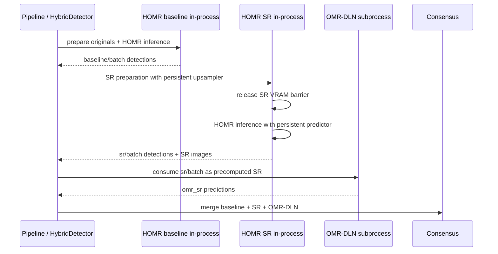
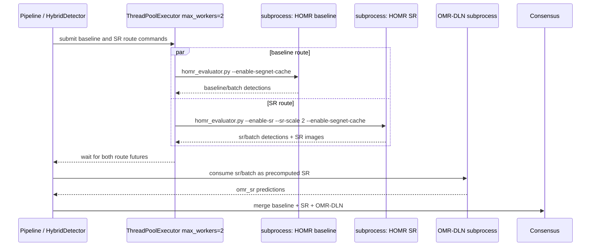

# Issue 163: HOMR/SR Route Parallelism Experiment

## Scope

Issue #163 evaluates whether Stage E runtime can be reduced by overlapping the HOMR baseline and HOMR SR routes without changing detector semantics.

The default Stage E path remains unchanged:

- HOMR baseline runs before HOMR SR.
- HOMR SR runs before OMR-DLN SR.
- OMR-DLN SR still consumes `sr/batch` as precomputed SR input.
- Hybrid consensus still consumes the baseline, SR, and OMR-DLN outputs.
- CNN scoring, detector thresholds, candidate generation, NMS policy, and downstream measure numbering are not changed.

The experiment is opt-in only. It must not be enabled in canonical configs unless a later adoption issue proves that it is safe and effective.

## Opt-in config

```yaml
detection:
  homr_route_parallel_experiment:
    enabled: true
    mode: baseline_sr_subprocess_overlap
    max_workers: 2
```

When disabled or omitted, `HybridDetector` uses the existing in-process sequential route.

The initial experiment intentionally uses subprocess HOMR route execution even when in-process HOMR is importable. This isolates each route in its own process and avoids sharing one in-process HOMR predictor or Real-ESRGAN upsampler across threads. The trade-off is higher process/GPU memory pressure, so this mode is experimental and bounded to `max_workers=2`.

## Flow comparison

Default sequential flow:



Opt-in subprocess-overlap experiment:



Expected speedup model before the experiment:

```text
sequential HOMR wall time ~= baseline + SR
parallel HOMR wall time ~= max(baseline, SR)
```

This would only help if the per-route durations stayed roughly unchanged while overlapped.

## Experiment result

The opt-in run preserved the canonical detector contract:

```text
expected_pages=68
evaluated_pages=68
missing_pages=[]
GT=3581
Pred=3600
TP=3580
FP=0
FN=1
FN_det=0
FN_cnn=1
cnn_apply_nms=false
target_met.detector=true
```

However, runtime and resources regressed:

- total runtime: 9764.83 sec
- pipeline runtime: 9704.30 sec
- HOMR overlap experiment duration: 9368.13 sec
- HOMR baseline subprocess duration: 5438.08 sec
- HOMR SR subprocess duration: 9368.13 sec
- peak GPU memory: 6780 MB
- peak process-tree RSS: 7525986304 bytes

The #159 reference evidence was roughly:

- total runtime: about 7611.6 sec
- full pipeline: about 7554.2 sec
- peak GPU memory: 4776 MB

The experiment therefore kept accuracy but did not reduce runtime.

## Rejection analysis

The observed regression is consistent with the following explanation:

1. **The critical path remained the SR route.**  In the parallel run, total overlap duration was essentially the HOMR SR subprocess duration. The baseline route finished earlier, but it did not matter because consensus and OMR-DLN cannot proceed until SR output exists.
2. **The subprocess route discarded the current in-process persistence advantage.**  The default path keeps HOMR execution in-process and uses persistent objects inside each route. The experiment starts separate `homr_evaluator.py` processes, which reintroduces process startup, independent model initialization, and separate CUDA/process memory pressure.
3. **Both subprocesses contended for the same GPU.**  Baseline HOMR inference and SR/HOMR processing ran at the same time on one GPU. The run reached 100% peak utilization and higher GPU memory. This can increase queuing and reduce effective throughput even though work is nominally parallel.
4. **Memory pressure increased.**  Peak GPU memory rose from the #159 reference level to 6780 MB. With two independent processes, model weights, CUDA context, buffers, and SR/HOMR intermediates are duplicated rather than reused.
5. **SR route slowdown dominated any baseline overlap benefit.**  The reference `homr_sr` evidence was about 5303 sec, while the experiment recorded 9368 sec for the SR subprocess. Even if baseline became fully hidden behind SR, the SR route itself became too slow.
6. **The experiment overlapped routes, not the useful subphases.**  The likely useful target is narrower: maintain in-process persistence and overlap only CPU/I/O-light or GPU-idle portions where the resource profile shows slack. Full-route subprocess overlap is too coarse.

## Decision

Do not adopt `baseline_sr_subprocess_overlap` as a default or recommended mode.

The experiment should remain evidence that naive route-level subprocess parallelism is unsafe/ineffective for the current Stage E runtime profile. No formal adoption issue should be created from this result.

## Required validation

Before considering any future experiment successful, run the canonical Stage E validation and compare both runtime and resources against the sequential baseline:

```bash
make run-issue120-stage-e-full \
  ISSUE120_STAGE_E_EXTRA_ARGS="--resource-sample-interval-sec 1.0"

make eval-issue120-stage-e-full

PYTHONPATH=. python3 tools/issue120/attach_stage_e_eval_contract.py \
  --manifest logs/issue120_e2e_recovery/stage_e_full_pipeline/manifest.json \
  --eval-dir logs/issue120_e2e_recovery/stage_e_full_pipeline/eval_detector \
  --score-threshold 0.1 \
  --xdist-threshold 12.0
```

Generated files under `logs/` are evidence artifacts and must not be committed.

## Follow-up candidates outside this experiment

The dependency review found additional runtime-reduction candidates that should remain separate from the initial route-level subprocess scheduling experiment:

- SR image/cache reuse across repeated Stage E attempts.
- Avoiding unnecessary repeated image copy/preparation work in the Stage E runner.
- Reducing redundant HOMR preparation work while preserving output layout and provenance.
- In-process SR preparation / HOMR inference overlap that preserves model persistence and explicit VRAM cleanup boundaries.
- Page chunking only if it can preserve cache behavior and stay below resource limits.
- Moving Stage E runner glue into a clearer pipeline module/API once the contract remains stable.

These may deserve separate issues if a future measurement confirms they are material bottlenecks or if the implementation would touch canonical pipeline structure rather than only opt-in scheduling.