# Pipeline Dataflow & Architecture (Phase 2 Optimized)

本文書では、Issue #60 および #24 に基づいて最適化されたパイプラインの詳細な処理フロー、ファイル構成、およびコンポーネント間のデータ遷移について説明します。

## 1. 詳細処理フロー図

以下の図は、`src/pipeline/main.py` の実行ロジックを詳細に示したものです。

```mermaid
flowchart TD
    Start([開始: main.py]) --> LoadConfig[Config読み込み & Run ID決定]
    LoadConfig --> Step1[Step 1: PDF抽出<br/>pdf_to_images.py]
    
    subgraph Step2 [Step 2: 検出フェーズ]
        direction TB
        DetInit[run_detection_step] --> HomrBase[Homr Baseline 推論<br/>Persistent Model]
        HomrBase --> HomrSR{SR有効?}
        HomrSR -- Yes --> RealESRGAN[Real-ESRGAN / Homr SR]
        HomrSR -- No --> Consensus[Hybrid Consensus生成]
        RealESRGAN --> OMRLDN[OMR-DLN 推論]
        OMRLDN --> Consensus
    end
    Step1 --> Step2

    Consensus --> Filter[ページフィルタリング<br/>Blank / Staff 密度チェック]
    
    subgraph PhaseA [Phase A: 初期ナンバリング & 小節線補正]
        direction TB
        ALoop{全ページループ} --> ACorrect[小節線補正<br/>User Overrides適用]
        ACorrect --> ADebug1{--debug?}
        ADebug1 -- Yes --> AWrite1[barlines_corrected.json]
        ADebug1 -- No --> ANum[インプロセス・ナンバリング<br/>Persistent Pipeline]
        AWrite1 --> ANum
        ANum --> AWrite2[numbering_base.json]
    end
    Filter --> PhaseA

    subgraph PhaseB [Phase B: MMR バッチ処理]
        direction TB
        BInit[MMRモデル初期化/取得<br/>Persistent ResNet/OCR] --> BBatch[全ページ一括 MMR推論]
        BBatch --> BWrite[overrides_mmr.json]
    end
    PhaseA --> PhaseB

    subgraph PhaseC [Phase C: 最終ナンバリング & 可視化]
        direction TB
        CLoop{全ページループ} --> CMerge[MMR + User 修正案の統合]
        CMerge --> CDebug1{--debug?}
        CDebug1 -- Yes --> CWrite1[overrides_combined.json]
        CDebug1 -- No --> CApply[統合修正案の適用<br/>In-Process]
        CWrite1 --> CApply
        CApply --> CWrite2[numbering_final.json]
        CWrite2 --> CDebug2{--debug / step_overlay?}
        CDebug2 -- Yes --> CWrite3[numbering_overlay.png]
        CDebug2 -- No --> CEndLoop[ループ終了]
        CWrite3 --> CEndLoop
    end
    PhaseB --> PhaseC

    subgraph Finalize [最終集計]
        FCombine[全ページの結果を1つのJSONに結合] --> FManifest[manifest.json 書き出し]
    end
    PhaseC --> Finalize
    Finalize --> End([終了])

    %% スタイリング
    classDef persistent fill:#e1f5fe,stroke:#01579b;
    class HomrBase,ANum,BInit,CApply persistent;
```

## 2. 出力ファイルとその役割

すべての出力は `logs/full_pipeline_runs/<run_id>/` 配下に格納されます。

### 2.1. 最終成果物 (常に生成)
| ファイルパス | 役割・内容 |
| :--- | :--- |
| `pipeline.log` | **実行ログ。** 標準出力および各ステップの進行状況、サブプロセスのログがすべて記録されます。Issue #59の成果を継承しています。 |
| `outputs/numbering_final.json` | **最重要成果物。** 全ページの最終的な小節番号、座標、所属譜表の情報が格納されています。 |
| `outputs/<page_id>/numbering_final.json` | ページごとの最終結果（上記ファイルの分割版）。 |
| `manifest.json` | この実行の「家計簿」。入力設定、実行されたコマンド、各ステップの成功/失敗、生成されたファイルパスの対応表が含まれます。 |
| `filters.json` | 各ページが「白紙」や「楽譜なし」と判定された理由とメトリクス。 |

### 2.2. 中間・デバッグファイル (`--debug` 有効時のみ)
これらは通常、開発やトラブルシューティング、精度の確認のために使用されます。

| ファイルパス | 役割・内容 |
| :--- | :--- |
| `inputs/images/page_XXX.png` | PDFからレンダリングされた高解像度画像（300dpi等）。 |
| `intermediate/<page_id>/barlines_corrected.json` | ユーザの `barline_overrides` に基づいて追加・削除が行われた後の小節線データ。 |
| `intermediate/<page_id>/numbering_base.json` | MMR（複数小節休符）の考慮を入れる前の、機械的な小節番号付与結果。 |
| `intermediate/<page_id>/overrides_mmr.json` | MMR検出器が提案した「この小節は実はX小節分である」という修正指示。 |
| `intermediate/<page_id>/overrides_combined.json` | MMRの提案と、ユーザが手動で指定した `measure_overrides` を矛盾なく統合した最終的な修正指示。 |
| `outputs/<page_id>/numbering_overlay.png` | `numbering_final.json` の内容を元画像に重ね書きした画像。目視確認用。 |

## 3. 実行形態の分類 (Subprocess vs In-Process)

スループット向上のため、可能な限りインプロセス化を進めていますが、環境依存の強いコンポーネントはサブプロセスとして分離しています。

| ステップ | 実行形態 | 理由 |
| :--- | :--- | :--- |
| `pdf_to_images` | **Subprocess** | `PyMuPDF` 等の外部ツール依存のため。 |
| `detection (homr)` | **Subprocess (Docker)** | `sr_eval_gpu` コンテナ内の特定環境（CUDA/依存ライブラリ）を必要とするため。 |
| `detection (Consensus)` | **In-Process** | JSONデータの論理演算のみであるため。 |
| `Phase A (Numbering)` | **In-Process** | 頻繁な再ロードを避けるため、`MeasureNumberingPipeline` を永続化。 |
| `Phase B (MMR)` | **In-Process** | ResNet/OCRモデルのVRAM占有を管理しつつ高速化するため、`MMRClassifier` 等を永続化。 |
| `Phase C (Finalize)` | **In-Process** | ロジックの柔軟な適用と速度のため。 |

## 4. コンポーネントの永続化 (キャッシュ) 戦略

「それを見ればコードが分かる」ための補足として、`src/pipeline/main.py` では以下のグローバル変数を使用してモデルを保持しています。

*   **`_PIPELINE_PERSISTENCE`**:
    *   `HomrPredictor`: 楽譜の構造解析モデル。
    *   `MeasureNumberingPipeline`: 番号計算ロジック。
*   **`_MMR_PERSISTENCE`**:
    *   `MMRClassifier`: 休符記号のCNN分類器（ResNet18）。
    *   `MMROCREngine`: 休符内の数字認識エンジン（RapidOCR）。

これらは `run_pipeline` をまたいでも（同じプロセスであれば）再利用されるため、大規模なバッチ処理や連続実行時のスループットが最適化されています。
