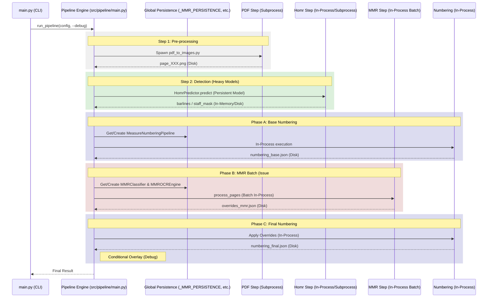

# Pipeline Dataflow & Architecture (Phase 2 Optimized)

本文書では、Issue #60 および #24 に基づいて最適化されたパイプラインのデータフロー、コンポーネント構成、および中間出力の管理について説明します。

## 1. 全体フロー図

最適化後のパイプラインは、プロセスの起動オーバーヘッドを最小化し、重いモデルをメモリ上に永続化（キャッシュ）する構成になっています。



## 2. 主要な最適化ポイント

### モデルの永続化 (Model Caching)
以下のコンポーネントは、複数ページ処理時に1度だけロードされ、メモリ上に保持されます。
*   **HomrPredictor**: `src/pipeline/main.py` の `_PIPELINE_PERSISTENCE` に保持。
*   **MMRClassifier (ResNet18)**: `_MMR_PERSISTENCE` に保持。
*   **MMROCREngine (RapidOCR)**: `_MMR_PERSISTENCE` に保持。
*   **MeasureNumberingPipeline**: `_PIPELINE_PERSISTENCE` に保持。

### インプロセス実行
従来、各ページごとに外部スクリプトとして起動していた以下の処理をライブラリとして直接呼び出す形式に変更しました。
*   **小節番号付与 (`tools/add_measure_numbers.py`)**: `MeasureNumberingPipeline` を直接使用。
*   **MMR検出 (`tools/generate_numbering_overrides.py`)**: `MMRProcessor` を直接使用。

これにより、Python インタープリタの起動、ライブラリ（`torch`, `cv2`等）のインポート、モデルのロードに伴う秒単位のオーバーヘッドが解消されました。

## 3. 出力ファイル構成とパス

出力は `logs/full_pipeline_runs/<run_id>/` 配下に整理されます。

### 基本出力 (常に生成)
| パス | 内容 |
| :--- | :--- |
| `manifest.json` | 実行構成、各ステップの入出力パス、実行ログのメタデータ。 |
| `filters.json` | ページごとのフィルタリング結果（Blank/Staff検知等）。 |
| `outputs/numbering_final.json` | 全ページの最終的な小節番号情報（結合済み）。 |
| `outputs/<page_id>/numbering_final.json` | ページごとの最終的な小節番号情報。 |

### 中間出力・デバッグ出力 (`--debug` 有効時のみ生成)
`--debug` フラグを付与しない場合、これらの中間ファイルの多くはディスクへの書き込みがスキップされ、I/O負荷が軽減されます。

| パス | 内容 |
| :--- | :--- |
| `inputs/images/page_XXX.png` | PDFから抽出された元画像。 |
| `intermediate/<page_id>/barlines_corrected.json` | 手動または自動で補正された小節線位置。 |
| `intermediate/<page_id>/numbering_base.json` | MMR補正前の初期小節番号。 |
| `intermediate/<page_id>/overrides_mmr.json` | MMRステップで検出された番号修正案。 |
| `intermediate/<page_id>/overrides_combined.json` | MMRとユーザ指定を統合した最終修正案。 |
| `outputs/<page_id>/numbering_overlay.png` | 小節番号を可視化した確認用画像。 |

## 4. 実行コマンド

### 通常実行 (高速・省I/O)
```bash
python3 src/pipeline/main.py --config configs/your_config.yaml
```

### デバッグ実行 (中間ファイル・可視化あり)
```bash
python3 src/pipeline/main.py --config configs/your_config.yaml --debug
```
