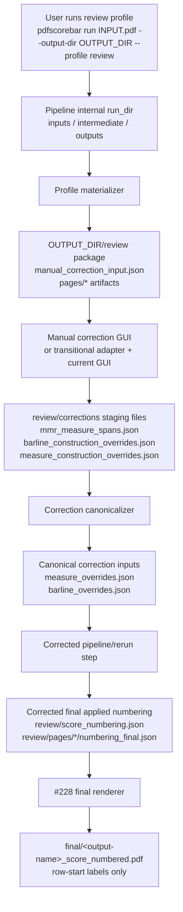
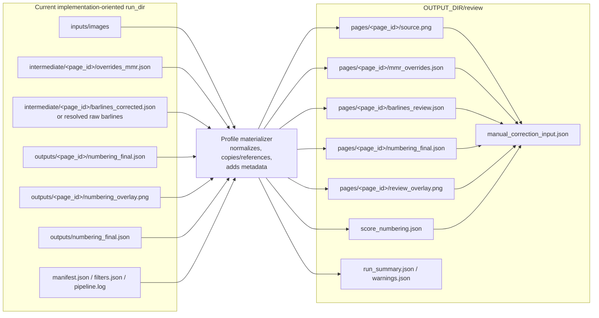
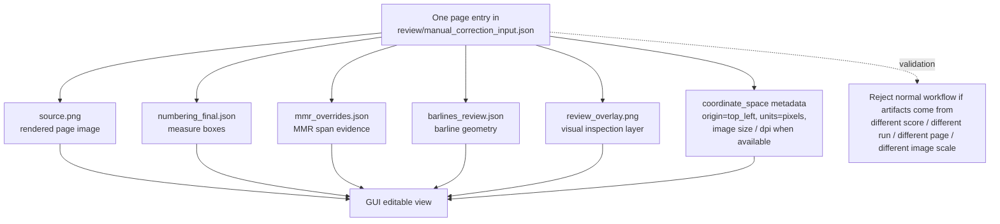
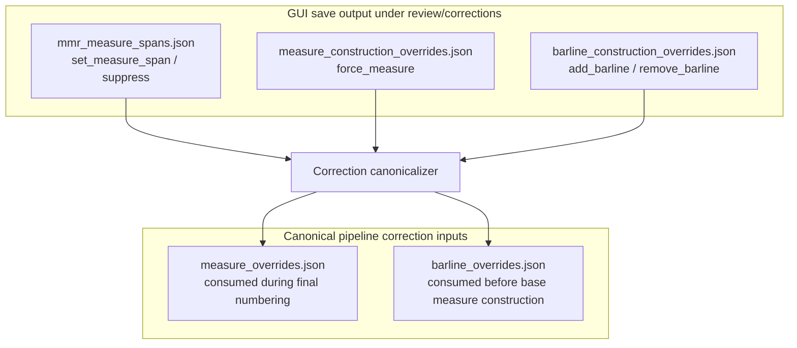
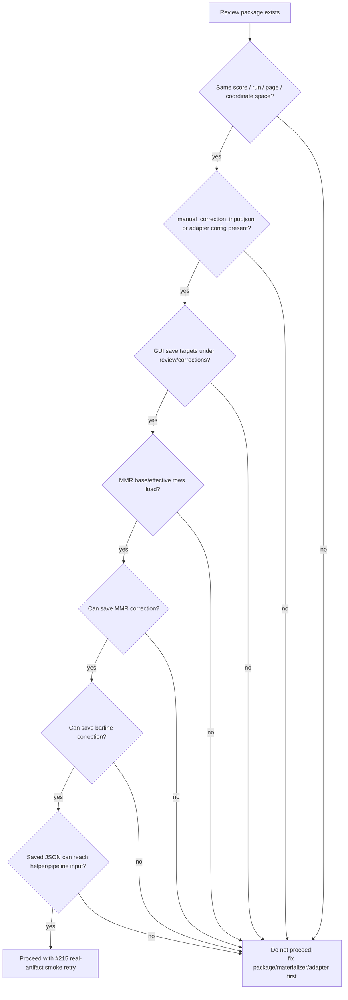

# Issue 229: Manual Correction Workflow Diagrams

## Status

- Parent epic: #225
- Task issue: #229
- Related design document: `ISSUE229_MANUAL_CORRECTION_WORKFLOW.md`
- Scope of this document: visual summaries of the review-package-to-GUI boundary and corrected-final regeneration workflow.

These diagrams are explanatory. They do not add implementation requirements beyond `ISSUE229_MANUAL_CORRECTION_WORKFLOW.md` and `MANUAL_CORRECTION_WORKFLOW_SPEC.yaml`.

## 1. End-to-end user workflow



Key point: the GUI does not search arbitrary `logs/` directories. It starts from a review package produced for one score/run/coordinate space.

## 2. Artifact boundary: current internal output to review package



Key point: `manual_correction_input.json` is a curated handoff, not a raw dump of the internal run directory.

## 3. Same-coordinate-space requirement



Key point: the first #215 attempt failed this boundary because image, numbering, MMR, and barline artifacts came from mismatched roots.

## 4. Correction output levels



Key point: GUI staging files mirror the current #201 GUI/helper categories. The pipeline rerun should consume canonical correction inputs.

## 5. Corrected final regeneration order

```mermaid
sequenceDiagram
  participant U as User
  participant G as Manual GUI
  participant C as review/corrections
  participant P as Pipeline correction step
  participant R as Review outputs
  participant F as Final renderer

  U->>G: Stage MMR / barline / measure corrections
  G->>C: Save staging JSON
  C->>P: Canonicalize to measure_overrides.json and barline_overrides.json
  P->>P: Apply barline_overrides before base measure construction
  P->>P: Apply measure_overrides before final applied numbering
  P->>R: Write corrected score_numbering.json and page numbering_final.json
  R->>F: Provide corrected final applied numbering
  F->>U: Write final/&lt;output-name&gt;_score_numbered.pdf
```

Key point: final rendering happens after corrections are applied semantically. The final PDF does not display correction provenance.

## 6. #215 retry gate



Key point: #229 does not replace #215. It defines the prerequisites for a meaningful #215 retry.
