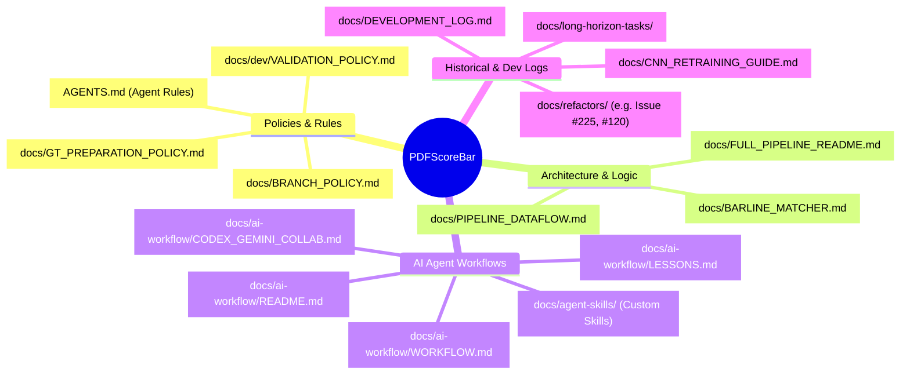

# PDFScoreBar Documentation Map

This map organizes the repository's extensive markdown documentation into functional categories. It was generated entirely within this local session by analyzing the project's file structure and index files (`docs/README.md`), without relying on external LLM APIs.

## 🗺️ Visual Map (Mermaid)

## 📂 Documentation Categories

### 1. Standing Policies (Core Rules)
These documents dictate how changes are made, tested, and governed.
*   [AGENTS.md](file:///home/masaki_muramatsu/ws_PDFScoreBar/AGENTS.md) - The ultimate rulebook for AI agents operating in this repository.
*   [docs/BRANCH_POLICY.md](file:///home/masaki_muramatsu/ws_PDFScoreBar/docs/BRANCH_POLICY.md) - Rules for branching (`develop` vs `main`) and promotions.
*   [docs/dev/VALIDATION_POLICY.md](file:///home/masaki_muramatsu/ws_PDFScoreBar/docs/dev/VALIDATION_POLICY.md) - Requirements for linting, testing, and verifying changes before PRs.
*   [docs/GT_PREPARATION_POLICY.md](file:///home/masaki_muramatsu/ws_PDFScoreBar/docs/GT_PREPARATION_POLICY.md) - Standards for Ground Truth data preparation.

### 2. Architecture & Pipeline Logic
These documents describe the technical flow and algorithmic designs.
*   [docs/README.md](file:///home/masaki_muramatsu/ws_PDFScoreBar/docs/README.md) - The master index of the `docs/` directory.
*   [docs/FULL_PIPELINE_README.md](file:///home/masaki_muramatsu/ws_PDFScoreBar/docs/FULL_PIPELINE_README.md) - Details the Phase 1 full pipeline orchestrator (`run_full_pipeline.py`) and config schemas.
*   [docs/PIPELINE_DATAFLOW.md](file:///home/masaki_muramatsu/ws_PDFScoreBar/docs/PIPELINE_DATAFLOW.md) - Dataflow and intermediate state representations.
*   [docs/BARLINE_MATCHER.md](file:///home/masaki_muramatsu/ws_PDFScoreBar/docs/BARLINE_MATCHER.md) - Detailed specification of the barline matching and deduplication logic.

### 3. AI Workflow & Agent Skills
Documentation for AI collaboration, self-evolution, and custom tools.
*   [docs/ai-workflow/WORKFLOW.md](file:///home/masaki_muramatsu/ws_PDFScoreBar/docs/ai-workflow/WORKFLOW.md) - Standard operating procedures for AI agents.
*   [docs/ai-workflow/CODEX_GEMINI_COLLAB.md](file:///home/masaki_muramatsu/ws_PDFScoreBar/docs/ai-workflow/CODEX_GEMINI_COLLAB.md) - Protocol for multi-agent (Codex + Gemini) collaboration.
*   [docs/ai-workflow/LESSONS.md](file:///home/masaki_muramatsu/ws_PDFScoreBar/docs/ai-workflow/LESSONS.md) - Shared knowledge base of anti-patterns and heuristics to prevent regression.
*   `docs/agent-skills/` - Guides and examples for developing and modifying agent skills.

### 4. Machine Learning & Detection (CNN)
*   [docs/CNN_RETRAINING_GUIDE.md](file:///home/masaki_muramatsu/ws_PDFScoreBar/docs/CNN_RETRAINING_GUIDE.md) - Procedure for retraining the CNN models using active learning.
*   [docs/ISSUE45_CNN_SCRIPT_INVENTORY.md](file:///home/masaki_muramatsu/ws_PDFScoreBar/docs/ISSUE45_CNN_SCRIPT_INVENTORY.md) - Inventory of scripts related to model training and evaluation.

### 5. Historical Context & Refactoring Log
These documents contain context on past decisions, which is crucial for understanding *why* the codebase is structured the way it is.
*   [docs/DEVELOPMENT_LOG.md](file:///home/masaki_muramatsu/ws_PDFScoreBar/docs/DEVELOPMENT_LOG.md) - The authoritative historical record of development.
*   `docs/refactors/` - Subdirectories (e.g., `issue120/`, `issue225/`) containing detailed logs of major system refactors and UI cleanups.
*   `docs/long-horizon-tasks/` - Plans, prompts, and benchmarks for complex, multi-stage efforts (e.g., SR optimization).
*   `docs/fp_reduction/` - History of False Positive reduction efforts in earlier phases.
